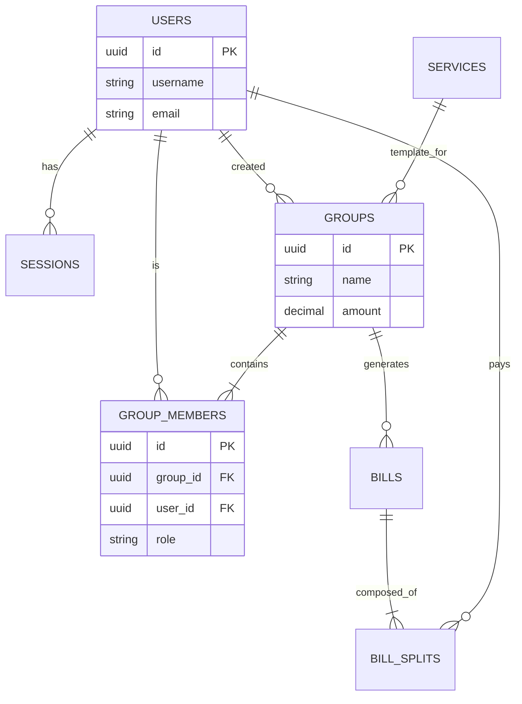

# Database Documentation

This document details the PostgreSQL database schema, including Row Level Security (RLS) policies, for the SubFlow application.

## Overview

-   **Database**: PostgreSQL v18+
-   **Extensions**: `pgcrypto` (for UUID generation)
-   **Security**: Row Level Security (RLS) enabled on sensitive tables.

## Schema

### Core Tables

#### `users`
-   **Purpose**: Stores user account information (Lucia Auth).
-   **Columns**: `id` (UUID), `username`, `email`, `password_hash`, `avatar_url`, `timestamps`.
-   **RLS Policies**:
    -   `SELECT`: Public (Authenticated users can read all users).
    -   `UPDATE`: Users can only update their own record (`id = current_user_id`).

#### `sessions`
-   **Purpose**: User session management.
-   **Columns**: `id`, `user_id`, `expires_at`, `timestamps`.
-   **RLS Policies**:
    -   `SELECT`, `DELETE`: Users can only access their own sessions.

### Groups & Services

#### `services`
-   **Purpose**: Catalog of available subscription services.
-   **Columns**: `id`, `name`, `domain`, `icon_url`, `is_system`, `created_by`.
-   **RLS Policies**:
    -   `SELECT`: Public (Everyone can read).

#### `groups`
-   **Purpose**: Represents a shared subscription group.
-   **Columns**: `id`, `name`, `description`, `service_id`, `amount`, `currency`, `billing_cycle`, `created_by`, `status`.
-   **RLS Policies**:
    -   `SELECT`: Members of the group can view.
    -   `INSERT`: Authenticated users can create groups.
    -   `UPDATE`: Only the group creator (`created_by`) can update.

#### `group_members`
-   **Purpose**: Mapping users to groups.
-   **Columns**: `id`, `group_id`, `user_id`, `role` (owner, admin, member), `share_ratio`.
-   **RLS Policies**:
    -   `SELECT`: Members within the same group can see each other.
    -   `INSERT`: Group creators can add members (or self-join if implemented).

### Finance

#### `bills`
-   **Purpose**: Payment requests sent to group members.
-   **Columns**: `id`, `group_id`, `title`, `total_amount`, `status`, `created_by`.
-   **RLS Policies**:
    -   `SELECT`: Group members can view bills.

#### `bill_splits`
-   **Purpose**: Individual share of a bill.
-   **Columns**: `id`, `bill_id`, `user_id`, `amount_owed`, `paid_amount`, `status`.
-   **RLS Policies**:
    -   Inherits access via `bill_id` -> `group_id` check.

## Row Level Security (RLS) Implementation

RLS is enforcing using a session-variable approach.

1.  **Context Propagation**: The backend uses `AsyncLocalStorage` to track the current `userId` for each request.
2.  **Query execution**: The `BaseRepository` wraps every query in a transaction that sets a local variable:
    ```sql
    SET LOCAL app.current_user_id = 'uuid-of-user';
    ```
3.  **Policy Definition**: Policies use this variable to restrict access.
    ```sql
    CREATE POLICY "Users can see own sessions" ON sessions FOR SELECT 
    USING (user_id = current_setting('app.current_user_id', true)::text);
    ```

> [!NOTE]
> `current_setting(..., true)` returns NULL if the variable is not set, preventing errors but potentially denying access (default deny).

## ER Diagram


